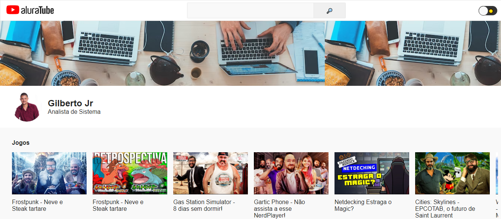
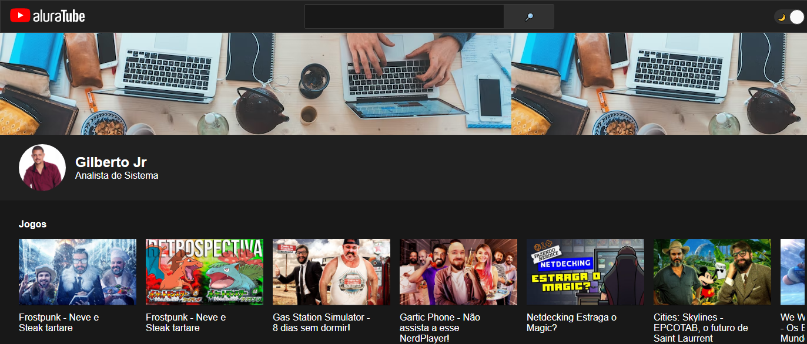
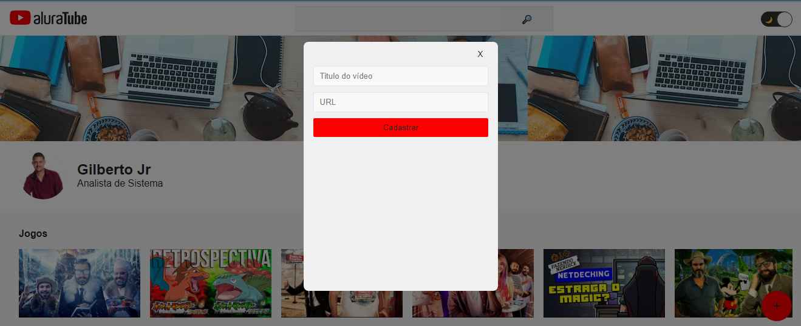
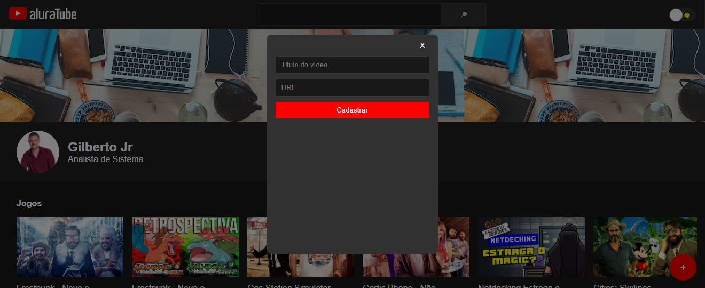

#  Imsersão AluraTube

Boas-vindas! Chegou a hora de desenvolver um projeto inédito durante a Imersão React!

Nesasa Imersão React vamos aprender como usar as estruturas de dados que temos no JavaScript para apresentar informações no lado do React.

## Resumo da Primeira Aula
1. Criamos o projeto inicial com NextJS;
2. Vimos NPM scripts;
3. Entendemos como checar a versão do Node e que o NPM vem junto com o projeto;
4. Utilizamos o npx gitignore node para gerar o gitignore do projeto;
5. Vimos a criação de um componente com React;
6. Vimos como trabalhar com estilos no React;
7. Como trabalhar com StyledComponents;
8. Vimos como usar Props no React;
9. Vimos sobre o children do React;
## Resumo da Segunda Aula
1. Criamos o nosso search.js;
2. Aprendemos sobre State;
3. Vimos o conceito de Prop-drilling;
4. Criamos o banner utilizando Styled Components e passando Props por ele.
## Resumo da Terceiras Aula
1. Começamos olhando o Design Systems;
2. Falamos sobre a importância de ter contratos de cores e valores de Design;
3. Criamos o componente Dark Mode Switch;
4. Criamos um state local no nosso componente de Dark Mode Switch;
5. Começamos a trabalhar esse state para não fazer Prop Drilling e sim ter um contexto que nos permite acessar os dados de forma "global";
6. E por fim, um Provider que configura quais dados vão estar disponíveis no contexto.
## Resumo da Quarda Aula
1. Importamos os estilos que criamos;
2. Começamos a trabalhar com formulários;
3. Vimos que lidar com Forms e State pode ser complexo;
4. Vimos como criar Custom Hooks.


### Dependência.

```
  "dependencies": {
    "next": "12.3.1",
    "react": "18.2.0",
    "react-dom": "18.2.0",
    "styled-components": "^5.3.6"
  } 
```


# Modo `LIGHT`.
<p align="center">

</p>

# Modo `DARK`.
<p align="center">

</p>


# Modo `MODAL LIGHT`.
<p align="center">

</p>


# Modo `MODAL DARK`.
<p align="center">

</p>


<h1 align="center">💻 Desenvolvido Por: Gilberto Júnior</h1>